+++
date = '2026-01-08T19:12:37+09:00'
draft = false
tags = ['tech', 'cdk', 'terraform', 'cloudformation', 'cf2tf', 'iac', 'backlog']
description = 'AWS CDKで作った構成をcf2tfでTerraformへ移行し、validate/import/planまでの手順とハマりどころをまとめました。'
title = 'Terraformに入門する'
+++

よ〜んです、今度こそTerraformに入門します。

## 今回の流れ

こんな感じの流れで進めていきます。

1. AWS CDKでデプロイする
1. AWS CDKでremovalPolicyを当てる
1. cf2tfで変換
1. terraform管理下へ移動
    1. terraform validate
    1. terraform import
    1. terraform plan    
1. terraformでapply(デプロイ)


## AWS CDKでデプロイ

[前回の記事](/posts/writing-the-first-aws-cdk-in-2026/)で`cf2tf`を使ってうまくいきませんでしたが、懲りずに使っていきます。

今回は以下の構成を作成していきます。

```mermaid
architecture-beta
  service apigw(logos:aws-api-gateway)[API Gateway]
  service sqs(logos:aws-sqs)[SQS]
  service lambda(logos:aws-lambda)[Lambda]

  apigw:R -- L:sqs
  sqs:R -- L:lambda
```



デプロイが完了し、動作も確認できました。

## AWS CDKでremovalPolicyを当てる

removalPolicyを各リソースに設定し、再度デプロイします。

```sh
Stack TerraformHandsonCdkStack
Resources
[-] AWS::ApiGateway::Deployment ApiGateway/Deployment ApiGatewayDeploymentA26796E894ec103d13e6ff7fa9f0b2d7210d7a88 destroy
[+] AWS::ApiGateway::Deployment ApiGateway/Deployment ApiGatewayDeploymentA26796E88dbee6e416fd69eb402670e32290cd3a
[~] AWS::SQS::Queue MessageQueue MessageQueue7A3BF959
 ├─ [~] DeletionPolicy
 │   ├─ [-] Delete
 │   └─ [+] Retain
 └─ [~] UpdateReplacePolicy
     ├─ [-] Delete
     └─ [+] Retain
[~] AWS::Lambda::Function ProcessorLambda ProcessorLambda71A929CE
 ├─ [+] DeletionPolicy
 │   └─ Retain
 └─ [+] UpdateReplacePolicy
     └─ Retain
[~] AWS::ApiGateway::RestApi ApiGateway ApiGateway11E7F47B
 ├─ [+] DeletionPolicy
 │   └─ Retain
 └─ [+] UpdateReplacePolicy
     └─ Retain
[~] AWS::ApiGateway::Stage ApiGateway/DeploymentStage.prod ApiGatewayDeploymentStageprod1C6D5CD6
 └─ [~] DeploymentId
     └─ [~] .Ref:
         ├─ [-] ApiGatewayDeploymentA26796E894ec103d13e6ff7fa9f0b2d7210d7a88
         └─ [+] ApiGatewayDeploymentA26796E88dbee6e416fd69eb402670e32290cd3a
[~] AWS::ApiGateway::Resource ApiGateway/Default/messages ApiGatewaymessagesC321BE78
 ├─ [+] DeletionPolicy
 │   └─ Retain
 └─ [+] UpdateReplacePolicy
     └─ Retain
[~] AWS::IAM::Role ApiGatewayRole ApiGatewayRoleD2518903
 ├─ [+] DeletionPolicy
 │   └─ Retain
 └─ [+] UpdateReplacePolicy
     └─ Retain
```

`npx cdk diff`するとこんな感じになりました。

## cf2tfで変換

```sh
mkdir terraform-handson-tf
```

適当にterraformのディレクトリを切ります。

```sh
cf2tf terraform-handson-cdk/cdk.out/TerraformHandsonCdkStack.template.json -o terraform-handson-tf
```

ちょっとでも楽したいので、cf2tfを使ってざっくり変換させます。

```sh
ls terraform-handson-tf

data.tf         output.tf       variable.tf
locals.tf       resource.tf
```

このようなファイルが出力されました。

## terraformに入門する

[Manage infrastructure | Terraform | HashiCorp Developer](https://developer.hashicorp.com/terraform/tutorials/aws-get-started/aws-manage)を参考にしました。

### validateする

`terraform init`して、`terraform validate`します。

```sh
Error: Incorrect attribute value type
Inappropriate value for attribute "assume_role_policy": string required, but have object.
```

IAM Roleのスキーマでエラーが出ていたので修正します。

```diff
- policy = {
+ policy = jsonencode({
    Statement = [
      {
        Action = [
          "sqs:ChangeMessageVisibility",
          "sqs:DeleteMessage",
          "sqs:GetQueueAttributes",
          "sqs:GetQueueUrl",
          "sqs:ReceiveMessage"
        ]
        Effect = "Allow"
        Resource = aws_sqs_queue.message_queue7_a3_bf959.arn
      }
    ]
    Version = "2012-10-17"
-  }    
+  })
`````mermaid
architecture-beta
  service apigw(logos:aws-api-gateway)[API Gateway]
  service sqs(logos:aws-sqs)[SQS]
  service lambda(logos:aws-lambda)[Lambda]

  apigw:R -- L:sqs
  sqs:R -- L:lambda

```

`string`ではなく、[jsonencode()](https://developer.hashicorp.com/terraform/language/functions/jsonencode)で`object`渡しします。

```sh
Error: Missing required argument
The argument "function_name" is required, but no definition was found.
```

terraform の [aws_lambda_function](https://registry.terraform.io/providers/hashicorp/aws/latest/docs/resources/lambda_function) では、`function_name` が必須だそうです。

CloudFormationのリソースタブからLambdaのfunction nameを引っ張ってきて、設定します。

```sh
Error: Incorrect attribute value type

code_sha256 = {
    S3Bucket = "${S3_Bucket}
    S3Key = "${S3_Key}
}

Inappropriate value for attribute "code_sha256": string required, but have object.
```

AWS CDKの場合、Lambdaで使用するコードをS3からいい感じに処理してくれますが、terraformへの変換にあたり、[archive_file](https://registry.terraform.io/providers/hashicorp/archive/latest/docs/resources/file)を使う方式に変更しました。

他にもAWS CDKのMetadataの情報が入っていたりするので、これらは削除しておきます。

```sh
terraform validate

Success! The configuration is valid.
```

validateが完了しました。**(ここまで1時間)**

### import する

ここから[import block](https://developer.hashicorp.com/terraform/language/block/import)を使ってインポートしていきます。


```sh
Plan: 13 to add, 0 to change, 0 to destroy.
```

まず初めに`terraform plan`をした結果、全て、`will be created`の状態となりました。

`resource.tf`の上から順番にインポートしていきます。

基本的にはCloudFormationのリソースタブの物理IDを入力すばよかったのですが、違うパターンも多かったので以下に載せておきます。

#### API Gateway Stage
```sh
Error: Unexpected format of ID ("prod"), expected REST-API-ID/STAGE-NAME
```

#### API Gateway resource
```sh
Error: Unexpected format of ID ("messages"), expected REST-API-ID/RESOURCE-ID
```

#### API Gateway method
```sh
Error: Unexpected format of ID ("${rest_api_id}|${resource_id}|POST"), expected REST-API-ID/RESOURCE-ID/HTTP-METHOD
```

#### IAM Role inline policy

```diff
- resource "aws_iam_policy" "api_gateway_role_default_policy_c1776_bbe" {
+ resource "aws_iam_role_policy" "api_gateway_role_default_policy_c1776_bbe" {
+ role = aws_iam_role.api_gateway_role_d2518903.id
  policy = jsonencode({
    Statement = [
      {
        Action = [
          "sqs:GetQueueAttributes",
          "sqs:GetQueueUrl",
          "sqs:SendMessage"
        ]
        Effect = "Allow"
        Resource = aws_sqs_queue.message_queue7_a3_bf959.arn
      }
    ]
    Version = "2012-10-17"
  })
  name = "ApiGatewayRoleDefaultPolicyC1776BBE"
  // CF Property(Roles) = [
  //   aws_iam_role.api_gateway_role_d2518903.arn
  // ]
}
```

IAM Role の inline policyは[aws_iam_policy](https://registry.terraform.io/providers/hashicorp/aws/latest/docs/resources/iam_policy)から[aws_iam_role_policy](https://registry.terraform.io/providers/hashicorp/aws/latest/docs/resources/iam_role_policy)にして対応しました。

とりあえず、全てのresouceをimportしました。

```sh
Plan: 12 to import, 4 to add, 1 to change, 3 to destroy.
```

### planする

細かいパラメーターの調整をしていきます。

`cf2tf`の仕様で、`rest_api_id`のキーに`rest_api`の`arn`を渡してしまうようです。それによって変更が起きていたので、修正していきます。

```sh
Plan: 12 to import, 1 to add, 2 to change, 0 to destroy.
```

ここまで減らせましたが、警告が出ているので治します。

```sh
Warning: Deprecated attribute

on output.tf line 2, in output "api_gateway_endpoint5_aa8_ec3_a":
2:   value = join("", ["https://", aws_api_gateway_rest_api.api_gateway11_e7_f47_b.arn, ".execute-api.", data.aws_region.current.name, ".", data.aws_partition.current.dns_suffix, "/", aws_api_gateway_stage.api_gateway_deployment_stageprod1_c6_d5_cd6.arn, "/"])

The attribute "name" is deprecated. Refer to the provider documentation for details.
```

`data.aws_region.current.name`を`data.aws_region.current.region`に変更します。

```sh
Warning: Argument is deprecated

with aws_iam_role.processor_lambda_service_role_e9_f4_ab56, on resource.tf line 28, in resource "aws_iam_role" "processor_lambda_service_role_e9_f4_ab56":

28:   managed_policy_arns = [
29:     join("", ["arn:", data.aws_partition.current.partition, ":iam::aws:policy/service-role/AWSLambdaBasicExecutionRole"])
30:   ]
 
managed_policy_arns is deprecated. Use the aws_iam_role_policy_attachment resource instead. If Terraform should exclusively manage all managed policy attachments (the current behavior of this argument), use the aws_iam_role_policy_attachments_exclusive resource as well.
```

```hcl
resource "aws_iam_role_policy_attachment" "processor_lambda_basic_execution" {
  role       = aws_iam_role.processor_lambda_service_role_e9_f4_ab56.name
  policy_arn = "arn:${data.aws_partition.current.partition}:iam::aws:policy/service-role/AWSLambdaBasicExecutionRole"
}
```

マネージドポリシーには、[aws_iam_role_policy_attachment](https://registry.terraform.io/providers/hashicorp/aws/latest/docs/resources/iam_role_policy_attachment)を使用するそうです。


次に、`CF Property`を削除していきます。

```diff
-  // CF Property(Roles) = [
-  //   aws_iam_role.processor_lambda_service_role_e9_f4_ab56.arn
-  // ]
```

上記のような、既に設定したものは削除します。

```diff
resource "aws_api_gateway_method" "api_gatewaymessages_postcebe9881" {
  authorization        = "NONE"
  http_method          = "POST"
  authorization_scopes = []
  request_models       = {}
  request_parameters   = {}
  resource_id          = aws_api_gateway_resource.api_gatewaymessages_c321_be78.id
  rest_api_id          = aws_api_gateway_rest_api.api_gateway11_e7_f47_b.id
  // CF Property(Integration) = {
  //   Credentials = aws_iam_role.api_gateway_role_d2518903.arn
  //   IntegrationHttpMethod = "POST"
  //   IntegrationResponses = [
  //     {
  //       ResponseTemplates = {
  //         application/json = "{"message": "Message sent to queue"}"
  //       }
  //       StatusCode = "200"
  //     }
  //   ]
  //   RequestParameters = {
  //     integration.request.header.Content-Type = "'application/x-www-form-urlencoded'"
  //   }
  //   RequestTemplates = {
  //     application/json = "Action=SendMessage&MessageBody=$input.body"
  //   }
  //   Type = "AWS"
  //   Uri = join("", ["arn:", data.aws_partition.current.partition, ":apigateway:", data.aws_region.current.name, ":sqs:path/", data.aws_caller_identity.current.account_id, "/", aws_sqs_queue.message_queue7_a3_bf959.name])
  // }
  // CF Property(MethodResponses) = [
  //   {
  //     StatusCode = "200"
  //   }
  // ]
}
```

API Gatewayの統合の処理がうまくいってなさそうなので、[aws_api_gateway_integration](https://registry.terraform.io/providers/hashicorp/aws/latest/docs/resources/api_gateway_integration)で書き直します。

```hcl
resource "aws_api_gateway_integration" "sqs_api_integration" {
  rest_api_id = aws_api_gateway_rest_api.api_gateway11_e7_f47_b.id
  resource_id = aws_api_gateway_resource.api_gatewaymessages_c321_be78.id
  http_method = aws_api_gateway_method.api_gatewaymessages_postcebe9881.http_method
  type = "AWS"
  request_parameters = {
    "integration.request.header.Content-Type" = "'application/x-www-form-urlencoded'"
  }
  request_templates = {
    "application/json" = "Action=SendMessage&MessageBody=$input.body"
  }
  uri = join("", ["arn:", data.aws_partition.current.partition, ":apigateway:", data.aws_region.current.region, ":sqs:path/", data.aws_caller_identity.current.account_id, "/", aws_sqs_queue.message_queue7_a3_bf959.name])
  credentials = aws_iam_role.api_gateway_role_d2518903.arn
  cache_key_parameters = []
  integration_http_method = "POST"
}
```

integrationのresponseは[aws_api_gateway_integration_response](https://registry.terraform.io/providers/hashicorp/aws/latest/docs/resources/api_gateway_integration_response)で書き直します。

```hcl
resource "aws_api_gateway_integration_response" "sqs_api_integration_response" {
  rest_api_id = aws_api_gateway_rest_api.api_gateway11_e7_f47_b.id
  resource_id = aws_api_gateway_resource.api_gatewaymessages_c321_be78.id
  http_method = aws_api_gateway_method.api_gatewaymessages_postcebe9881.http_method
  status_code = aws_api_gateway_method_response.response_200.status_code
  response_templates = {
    "application/json" = "{\"message\": \"Message sent to queue\"}"
  }
}
```

メソッドのレスポンスも[aws_api_gateway_method_response](https://registry.terraform.io/providers/hashicorp/aws/latest/docs/resources/api_gateway_method_response)で書き直します。

```hcl
resource "aws_api_gateway_method_response" "response_200" {
  http_method = aws_api_gateway_method.api_gatewaymessages_postcebe9881.http_method
  resource_id = aws_api_gateway_resource.api_gatewaymessages_c321_be78.id
  rest_api_id = aws_api_gateway_rest_api.api_gateway11_e7_f47_b.id
  status_code = "200"
}
```

これらはAWS CDKのリソースとしては定義されていませんでしたが、無理やりインポートしてみます。

```sh
Plan: 15 to import, 1 to add, 0 to change, 0 to destroy.
```


## terraform applyする

```sh
Do you want to perform these actions?
  Terraform will perform the actions described above.
  Only 'yes' will be accepted to approve.

  Enter a value: yes
```

`terraform apply`できました。


`npx cdk drift`してみます。

```sh
Stack TerraformHandsonCdkStack
Modified Resources
[~] AWS::ApiGateway::Stage ApiGateway/DeploymentStage.prod ApiGatewayDeploymentStageprod1C6D5CD6
 └─ [~] /DeploymentId
     ├─ [-] 1hi0t5
     └─ [+] 9m147t

1 resource has drifted from their expected configuration
```

API GatewayのデプロイIDのみが変更された状態になっております。

> 今考えればAPI Gatewayのデプロイもimportすればよかったなと思っています

## まとめ

AWSCDKで作ったAPI Gateway / SQS / Lambda構成を、cf2tfでterraformへ移行する流れを検証した。

cf2tfで生成されたterraformのファイルでimportはCloudFormationの物理IDで概ね大丈夫だったが、IAMやLambda、API Gateway周りのスキーマ差分修正が多かった。

cf2tfはCloudFormationの論理IDとterraformのresource idが対応するため、importは非常にやりやすかったです。色々お手伝いしようと思います。

terraformの宣言的な書き方や依存関係を意識しなくていい点も良く、CDKからterraformへの移行感覚を掴めました。

近いうちにもうちょっと複雑な構成にチャレンジしてみようと思います。
