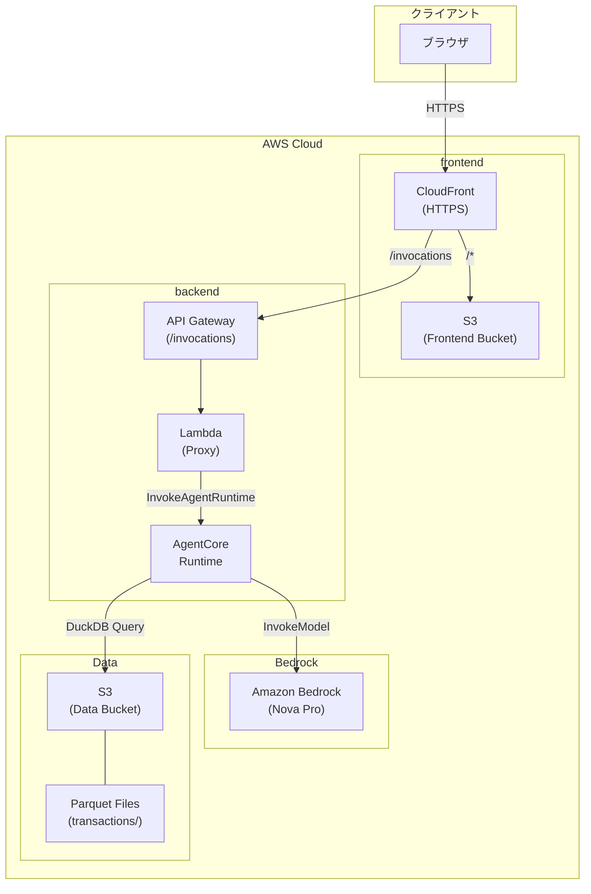

+++
date = '2025-12-30T17:55:30+09:00'
draft = false
tags = ['tech', 'aws', 'parquet', 'agentCore', 'duckdb','catch-up-2025-2026-vacation']
description = '家計簿（クレカ取引履歴）のCSVをGlueでParquet化してS3に保存し、DuckDB＋AIエージェントでクエリ・分析して無駄な支出を炙り出してみた。'
title = 'ParquetとAIエージェントで無駄な出費を特定してみる'
+++

よ〜んです。

ParquetとかIcebergとか触ってみたいな〜とずっと思っていましたが、触れずに半年ぐらい経ってしまいました。

とはいえ、
- よほど大きなデータじゃないと旨みなさそう
- （個人的な話）そもそも分析したいデータもない
などいって、何となく手を付けていませんでした。

でも今はそんなに困ってないけど、後から見返すと良さそうなデータ”って、意外と普段の生活にもある気がします。

そうです、家計簿(クレカの取引履歴)ですね！

ということで、本記事では家計簿をParquet形式で保存して、AIエージェントに分析させて見ようと思います。

## (本題の前に)用語整理

ParquetとIceberg、S3 Tablesがごっちゃになっているので、整理します。

- Apache Parquet
	- 列指向のファイルフォーマット
- Apache Iceberg
	- 複数のParquetファイルをテーブルとして扱うための仕組み
- Amazon S3 Tables
	- Apache Icebergサポートがされている、大規模な表形式データを効率的に扱える
	- 通常のS3と比べて最大10倍高速に処理が可能

なるほど、個人的にはsqliteと何が違うんだやろとか思ってましたが、違いがわかってきました。

1ファイルでデータを持てて、スキーマ管理ができて、クエリも流せるという点ではsqliteと似ている部分もありますが、Parquetは扱えるデータ量のオーダーが全然違います。
また、今回のような時系列の履歴データのように、大量のレコードを効率よく格納したい場合にも最適なフォーマットだと感じました。

## 早速実装していく

今回はこのようなアプリケーションを作っていきます。
データ量的にオーバースペックな気がしますが、せっかくなのでCSVからParquetへの変換にGlueを使ってみます。

### ETL(Glueジョブ)部分

この部分っは超シンプルで、csvをParquet形式に変換し、S3の指定ディレクトリ（年月ごとのパーティション）に保存するだけです。

具体的には、以下のような流れです。

1. S3にアップロードされたCSVを読み込み
2. 日付や金額など必要なカラムだけを抽出する
3. ファイル名から読み取った「年」「月」情報をもとにパーティションを作成
4. データをParquet形式でS3に保存します（year, month単位のパーティション構成）

これにより、AthenaやDuckDBなどのクエリエンジンで効率よくデータを処理できる形式にできました。(多分)

### エージェント部分

DuckDBをどこに置くか問題に悩みましたが、今回はとりあえずAgentCore Runtime上にDuckDBものせてしまいます。

今回はコンテキストが鍵を握っていそうな気がしたので、がっつり書きました。

## 動作チェック

デプロイが完了したので、まずはcsvからParquetに変換するGlueを走らせます。

初めて触ったので、こんな感じなんだ〜とか思いつつ、なんとなくで`pyspark`を書いたので、普通にLambdaで良かったんじゃないかとか思ったり...

2025年1月から2025年11月までの取引履歴をParquetにできたので、AgentCoreに問い合わせしてみます。

思い当たりがありません...8月の食費高騰の原因を聞いてみます。

思い当たりしかありません...🫠

次は毎月引き落とされている項目について調査してもらいます。

嘘だろ......

普段🉐**が好き**とか言っていますが、財布の紐はゆるゆるなことがわかりました...このブログを公開したら解約していきます...

最後に来年(2026年)に向けてアドバイスをいただきます。

ありがたいお言葉を頂戴しました。

## まとめ

家計簿のデータをParquetにして、AIエージェントに分析させるところまで一通り試してみました。

今回やってよかったことは、次の2つです。

- Parquet / Iceberg / S3 Tablesの位置づけを理解した
- AIエージェント経由でサクッと分析できる形にできた

Parquetを触れたことはもちろんですが、無駄なサブスクが炙り出せたのが結構嬉しかっです。

一方で反省点もあります。

Glueは勉強になったものの、今回の規模だと普通にLambdaで変換してもよかった気がします。

~~そもそもDuckDBでCSVを直接クエリでも成立するでしょというコメントは控えてくださいw~~

サブスクたちを解約してきます、では
