+++
date = '2026-01-17T15:20:37+09:00'
draft = true
tags = ['tech', 'cdk', 'cloudformation', 'catch-up-2025-2026-vacation']
description = '手動で作成したAWSリソースをCloudFormationやAWS CDKで管理するプロセスを実践し、過程での学びを共有します。'
title = '手動で作ったリソースをCloudFormationのスキャンやCDK importを使って取り込む'
+++

よ〜んです。

手動で作成したリソースをCloudFormationやAWS CDKで取り込むことをした事がなかったため、練習と検証を兼ねてやってみます。

## 構成図
今回手動で作成した構成はこんな感じです。

```mermaid

architecture-beta
  service waf(logos:aws-waf)[WAF]
  service cf(logos:aws-cloudfront)[CloudFront]
  service s3(logos:aws-s3)[S3]

  waf:R -- L:cf
  cf:R -- L:s3
```

OACが自動生成されていたり、CloudFrontのFreePlanのおかげでAWS WAFがついていたりします。

## 手順

1. CloudFormation のIaCジェネレーターのスキャンを実施    
1. `cdk migration`を実行
1. `cdk import` を実行
1. `cdk drift`を実行

### CloudFormation のIaCジェネレーターのスキャンを実施


とりあえずフルスキャンします。


手動で作成したS3とCloudFrontを検索して、リソースを追加します。


**関連リソースを追加**、これはありがたい。

自動生成されるようなリソースもこっち側で探して取り込む必要があるのかと思っていたので、助かります。

生成結果を確認します。


CloudFormationのテンプレートが表示されていますね


警告が出ていますが、ぱっと見問題なさそうです。

###  `cdk migration`を実行

```sh
cdk migrate --stack-name sample-dev --from-path ./sample-dev.yaml --language typescript

SampleDevStack could not be generated because None is not implemented for ResourceValue::Object
```

めっちゃエラーが出ます。

どうやら、一発で動くものはなかなか出てこないようです。

AIと気合いで直していきます。

```diff
--- development/invalid-sample-dev.yaml	2026-01-18 18:42:15
+++ development/sample-dev.yaml	2026-01-18 20:10:05
@@ -34,7 +34,6 @@
           Id: "xxxxxxx.s3.us-east-1.amazonaws.com"
         ViewerCertificate:
           MinimumProtocolVersion: "TLSv1"
-          SslSupportMethod: "vip"
           CloudFrontDefaultCertificate: true
         PriceClass: "PriceClass_All"
         DefaultCacheBehavior:
@@ -43,8 +42,6 @@
           LambdaFunctionAssociations: []
           TargetOriginId: "xxxxxxx.s3.us-east-1.amazonaws.com"
           ViewerProtocolPolicy: "redirect-to-https"
-          GrpcConfig:
-            Enabled: false
           TrustedSigners: []
           FieldLevelEncryptionId: ""
           TrustedKeyGroups: []
@@ -81,12 +78,10 @@
     Type: "AWS::WAFv2::WebACL"
     DeletionPolicy: "Retain"
     Properties:
-      Description: ""
+      Description: "WAF for yoon website"
       DefaultAction:
         Block: {}
       Scope: "CLOUDFRONT"
-      OnSourceDDoSProtectionConfig:
-        ALBLowReputationMode: "ACTIVE_UNDER_DDOS"
       Rules:
       - Action:
           Allow: {}
@@ -160,7 +155,7 @@
     Properties:
       OriginAccessControlConfig:
         SigningBehavior: "always"
-        Description: ""
+        Description: "OAC for yoon website"
         SigningProtocol: "sigv4"
         OriginAccessControlOriginType: "s3"
         Name: "xxxxxxx.s3.us-east-1.amazonaws.com"
@@ -189,7 +184,6 @@
     Type: "AWS::S3::Bucket"
     DeletionPolicy: "Retain"
     Properties:
-      AbacStatus: "Disabled"
       PublicAccessBlockConfiguration:
         RestrictPublicBuckets: true
         IgnorePublicAcls: true
```

`cdk migration`が通りました。

### `cdk import`を実行

```sh
cdk import
sample-dev
start: Building sample-dev Template
success: Built sample-dev Template
start: Publishing sample-dev Template (current_account-current_region-e6a2e3aa)
success: Published sample-dev Template (current_account-current_region-e6a2e3aa)
sample-dev/CloudFrontCachePolicy (AWS::CloudFront::CachePolicy): enter Id (empty to skip) xxxxxxxx-xxxx-xxxx-xxxx-xxxxxxxxxxxx
sample-dev/CloudFrontOriginAccessControl (AWS::CloudFront::OriginAccessControl): enter Id (empty to skip) XXXXXXXXXXXXXX
sample-dev/S3BucketDevmu7889yoonsite (AWS::S3::Bucket): import with BucketName=xxxxxxx (y/n) y
sample-dev/WAFv2WebACLCLOUDFRONT (AWS::WAFv2::WebACL): enter Name (CreatedByCloudFront-xxxxxxxx) 
sample-dev/WAFv2WebACLCLOUDFRONT (AWS::WAFv2::WebACL): enter Id (empty to skip) xxxxxxxx-xxxx-xxxx-xxxxxxxxxxxx
sample-dev/WAFv2WebACLCLOUDFRONT (AWS::WAFv2::WebACL): enter Scope (CLOUDFRONT) 
sample-dev/CloudFrontDistribution (AWS::CloudFront::Distribution): enter Id (empty to skip) XXXXXXXXXXXXX
sample-dev: importing resources into stack...
sample-dev: creating CloudFormation changeset...
```

対話的な感じで物理IDなどを入力していきます。


`IMPORT_IN_PROGRESS` 初めて見るステータスです。

```sh
 ✅  sample-dev
Import operation complete. We recommend you run a drift detection operation to confirm your CDK app resource definitions are up-to-date. Read more here: https://docs.aws.amazon.com/AWSCloudFormation/latest/UserGuide/detect-drift-stack.html
```

L1コンストラクトの状態でAWS CDKの管理下に置くことができました。

### `cdk drift`を実行

```sh
Stack sample-dev
Modified Resources
[~] AWS::CloudFront::OriginAccessControl CloudFrontOriginAccessControl CloudFrontOriginAccessControl
 └─ [~] /OriginAccessControlConfig/Description
     ├─ [-] OAC for yoon website
     └─ [+]
```

これは、AIとの作業でゴニョゴニョした部分ですので、削除するだけでOKです。

## まとめ

手動作成済みのリソースを、スキャンで洗い出してから、`cdk migrate` と `cdk import` を使ってAWS CDK管理下へ移せました。

`cdk migrate` は便利ですが、L1のままだとAWS CDKの旨味が薄いので、L2への書き換えなどを含めた、もう少し深い話を2026年2月1日に開催される[JAWS-UG 茨城 #11 CDK支部コラボ回](https://jawsug-ibaraki.connpass.com/event/379428/)でお話ししようと思います。

ではでは〜
