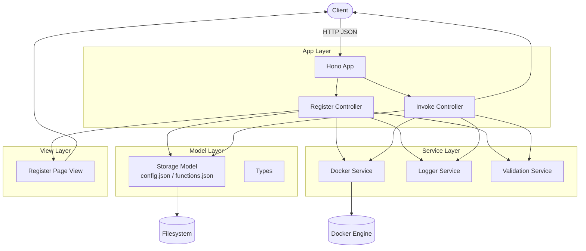

+++
date = '2026-01-11T14:00:15+09:00'
draft = false
tags = ['tips', 'raspberrypi', 'docker', 'hono']
description = 'Raspberry PiでFaaS基盤構築の試行錯誤から、フルスクラッチでプラットフォームを開発した過程を詳細に解説します。'
title = 'ご家庭FaaSを作ろう、そしてLambda、GASのありがたみを知ろう。'
+++

よ〜んです。

年末に大掃除していたらRaspberry Piが出てきたので、FaaS基盤を作って遊ぼうと思います。

まずは既にあるFaaSのOSSで済ませられないかな？と思い、いくつか候補を調べてみました。

ただ、Raspberry Pi 3という制約が思ったより重くて、結局どれも微妙に合わず…という感じでした...

他にいいのがあれば教えてください。

## Firecracker

AWS LambdaやAWS Fargateで使用されているKVMです。

個人的に一番試したかったやつでしたが、

Raspberry Pi 3 Model Bに載っているチップはKVMに必要なArmのVirtualization Extensionsが無く、Firecracker自体が動きません。

ハードウェアが非対応なので、泣く泣く見送り。

## OpenFaaS (Faasd)

OSSで遊びたいのに、ライセンスが複雑で、軽く触れなさそうだったため断念。

あと、Raspberry Piでやるので、Kubernetesベースの導入はちょっと重いかなと。

## Fn Project

Arm 64のビルドがないため却下...。

Go のバージョンも、ビルドするための環境構築も今のドキュメントではできなさそうな感じ😢

## なんちゃってFaaSプラットフォームをフルスクラッチする

かなり時間を使ってしまいましたが、Vibe CodingでFaaSプラットフォームをフルスクラッチしました。

色々セキュリティ的にやってはいけないことをしていますが、今回は個人検証の範疇のため目を瞑ってくださいw。

### 採用スタック

- hono
- Docker

### アーキテクチャ



ぼんやり設計だけして、Claude Codeに投げました。

### 実際に使ってみる

#### 関数の登録

```sh
ls functions
hello
```

登録前の`functions`配下

動作確認用で作った`hello`関数があることがわかります、では、Web UIから「Nまでの素数を数える関数」をデプロイしてみます。


こんな感じで登録できます。任意のイメージを実行可能ですが、ホストマシンのスペックの関係上、`oven/bun:canary-alpine`で決めうちです。

```sh
ls functions
hello  prime-count
```

Web UIから登録した関数が`functions`配下に登録されていることが確認できました。

#### 関数の呼び出し

```sh
curl -s -X POST raspberrypi.local:8787/function/prime-count \
  -H 'content-type: application/json' \
  -d '{"body":{"n":10},"metadata":{}}'
```

しばらく待つと、レスポンスが返ってきました。

```sh
{"statusCode":200,"body":"4"}
```

Raspberry Pi側のログも見ておきます。

```sh
[2026-01-11T16:19:53.931Z] invoke start {
  name: "prime-count",
  image: "oven/bun:canary-alpine",
}
[2026-01-11T16:19:56.167Z] invoke success {
  name: "prime-count",
  statusCode: 200,
}
```

きちんと実行されていることがわかります。

## まとめ

関数の登録・実行自体はサクッとシンプルに作れましたが、実際のサービスに必要な認証やらスケーリング、監視、ログ…を考えると、一気に現実が見えてくるやつでした。

Google Apps Script, AWS Lambda の、個人ではなかなか使いきれない圧倒的な無料枠に対してありがたみを噛み締めていこうと思いました。

> AWS様、Google様へ
> 
> 圧倒的な無料枠、ありがとう。
> 
> よ〜んより


では、
