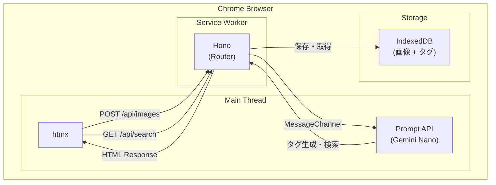

+++
date = '2025-12-31T18:24:50+09:00'
draft = false
tags = ['tech', 'prompt-api', 'hono', 'htmx']
description = 'ChromeのPrompt APIやIndexedDBなどを使用して、Chromeだけで画像を検索できるアプリケーションを作ってみました。'
title = 'ChromeのPrompt APIを使い尽くす'
+++

よ〜んです。

今回は、Chrome Prompt APIを使って遊び尽くそうと思います。

## Chrome Prompt APIとは

Chrome 131から利用可能になった、ブラウザ内蔵のAIです。Gemini Nanoがローカルで動作するため、オフラインでも推論ができます。

有効化するには以下のフラグを設定する必要があります：
- `chrome://flags/#prompt-api-for-gemini-nano`
- `chrome://flags/#optimization-guide-on-device-model`

さらに `chrome://components` から「Optimization Guide On Device Model」をダウンロードしておく必要があります。

## IndexedDB

ブラウザ内蔵のNoSQLデータベースです。今回は画像のBlobデータをそのまま保存するために使っています。

```javascript
const req = indexedDB.open('image-db', 1)
req.onupgradeneeded = () => {
  req.result.createObjectStore('images', { keyPath: 'id' })
}
```

画像データは以下の形式で保存しています：

```javascript
{
  id: crypto.randomUUID(),
  fileName: file.name,
  mimeType: file.type,
  blob: file,           // 画像のBlobをそのまま保存
  annotation: '',       // AIが生成したタグ
  createdAt: Date.now()
}
```

## 今回作るアプリケーション

「画像タグ検索」というアプリを作りました。画像をアップロードすると、AIが自動でタグを生成してくれて、自然言語で検索できるというものです。

よくネットミームの画像をチャットにはったりするのですが、画像のイメージはあるのに、なんて検索したらいいかわからない時ってありますよね。

ファイル名は適当だし、フォルダ分けもしてないし。「あの猫のやつ」「サイバー空間で変なサングラスしてパソコン触ってる人」みたいな曖昧な記憶で探せたらいいなと思って作りました。

- ローカル動作: サーバーへの通信なし。画像データもAI処理もすべてブラウザ内で完結
- **完全無料**: ローカルLLMなのでAPIキーも課金も不要。何回使ってもタダ
- **自然言語検索**: 「生き物」で検索すると猫や犬の画像がヒット。タグの完全一致じゃなくて意味的に検索できる
- **バックエンドレス**: REST API風のエンドポイントがあるけど、実体はService Worker。サーバー不要

### 技術スタック

| 役割 | 技術 |
|------|------|
| 画像保存 | IndexedDB |
| タグ生成 | Chrome Prompt API (Gemini Nano) |
| ルーティング | Hono on Service Worker |
| フロント | htmx + Tailwind CSS |

### アーキテクチャ



Prompt APIはService Worker内で使えないので、MessageChannelでメインスレッドにプロキシしています。ちょっとトリッキーだけど、これでService Worker内からAI機能を呼び出せるようになりました。

## 実装していく

### DB

IndexedDBのラッパーを作りました。Promise化してます。

```javascript
export async function getAllImages() {
  const db = await openDB()
  const store = db.transaction('images', 'readonly').objectStore('images')
  return new Promise((resolve, reject) => {
    const req = store.getAll()
    req.onsuccess = () => resolve(req.result)
    req.onerror = () => reject(req.error)
  })
}
```

### Routing

Service Worker内でHonoを使ってルーティングしています。`/api/*` へのリクエストをインターセプトして処理します。

```javascript
import { Hono } from 'https://esm.sh/hono@4'

const app = new Hono()

app.get('/api/images', async (c) => {
  const all = await getAllImages()
  return c.html(renderList(all))
})

app.post('/api/images', async (c) => {
  const files = (await c.req.formData()).getAll('file')
  for (const file of files) {
    await saveImage(file, await requestAnnotation(file))
  }
  return c.html(renderList(await getAllImages()))
})

self.addEventListener('fetch', (e) => {
  if (new URL(e.request.url).pathname.startsWith('/api')) {
    e.respondWith(app.fetch(e.request))
  }
})
```

### Prompt API

サービスワーカーでPrompt APIにアクセスできないのでMessageChannelを使ってService Workerとメインスレッド間で通信しています。

```javascript
// メインスレッド側
const channel = new MessageChannel()
channel.port1.onmessage = handleMessage
navigator.serviceWorker.controller?.postMessage({ type: 'INIT_PORT' }, [channel.port2])

function handleMessage(e) {
  if (e.data.type === 'ANNOTATE') {
    annotateImage(e.data.blob).then(annotation => 
      e.currentTarget.postMessage({ id: e.data.id, annotation })
    )
  }
}
```

画像のアノテーション生成はこんな感じ：

```javascript
async function annotateImage(blob) {
  const session = await self.LanguageModel.create({
    expectedInputs: [{ type: 'image' }, { type: 'text' }],
    languageCode: 'ja'
  })
  
  const file = new File([blob], 'image.jpg', { type: blob.type })
  let result = ''
  
  for await (const chunk of session.promptStreaming([{
    role: 'user',
    content: [
      { type: 'text', value: 'この画像に含まれる要素をタグ形式で列挙してください。' },
      { type: 'image', value: file }
    ]
  }])) {
    result += chunk
  }
  
  session.destroy()
  return result
}
```

検索もAIを使って意味的なマッチングをしています。「生き物」で検索すると猫や犬の画像がヒットするようになっています。

### フロント

特になし、htmxとtailwindを使って実装した。ここら辺はAIにお任せです。

htmxのおかげでJavaScriptをほとんど書かずにSPA的な動作を実現できています。

```html
<input type="file" accept="image/*" multiple
  hx-post="/api/images"
  hx-target="#imageList"
  hx-encoding="multipart/form-data">

<input type="search" name="q" placeholder="自然言語で検索..."
  hx-get="/api/search"
  hx-trigger="input changed delay:500ms"
  hx-target="#imageList">
```

## 使ってみる

適当なミーム画像を登録していきます。


いい感じにタグが生成されていますね。


タグには`眼鏡`で登録されていますが、`メガネ`で検索することができました。

## まとめ

Chrome Prompt APIを使って画像タグ検索アプリを作ってみました。

正直、ローカルLLM侮ってました。Gemini Nanoでも画像認識できるし、意味的な検索もちゃんと動く。しかもタダ。APIキーの管理とか課金の心配とかしなくていいの最高。

Service Worker + Hono + IndexedDB の組み合わせも検証できてよかったなと思います、バックエンドなしでREST APIっぽいアーキテクチャが作れるのは夢があます

ぜひ使ってみてね、よ〜んには何も飛んで来ませんが、変な画像とかは保存しない方がいいと思います

[画像タグ検索](/image-finder/)